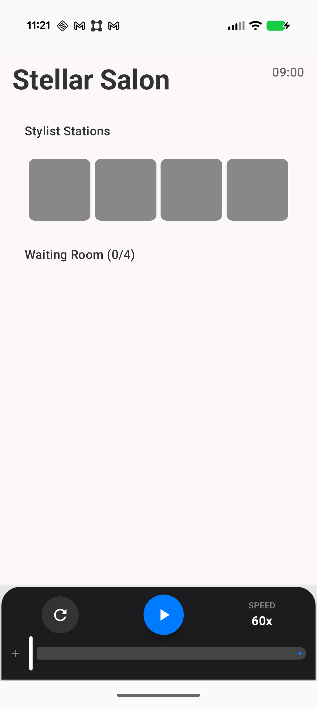
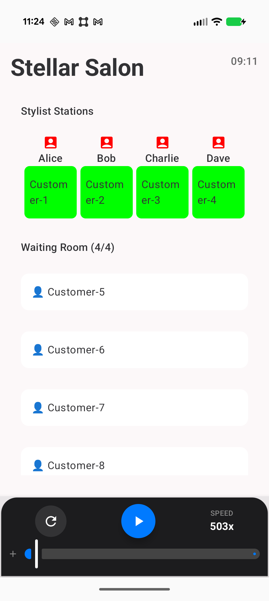

Stellar Salon Simulation
=======================

Technical Overview & Run Guide
------------------------------

###  How to Run
1. Setup: Open the project in Android Studio.

2. Launch: Run the app on an emulator or a physical phone (API 26 or higher).

3. Use: The simulation is controlled through a dedicated panel at the bottom of the screen. Tap the Play button to start the simulation. Tap it again to pause it. To restart the whole simulation again, press refresh button on the left.

4. Move the slider to speed up time (up to 10,000x).

You'll see customers enter the waiting room and move to chairs as barbers become free.

### Visuals
<table>
  <tr>
    <td></td>
    <td></td>
  </tr>
</table>


### How I Built It

I built the simulation using Kotlin and Jetpack Compose following a Unidirectional Data Flow (UDF) pattern. The core logic is in a **BarberShopEngine** class that processes the shop day minute-by-minute. I used a **ViewModel** to bridge the engine and the UI, ensuring that as the engine "ticks," the screen updates instantly. To handle the high-speed requirement, I used a Coroutine that calculates its delay based on the slider position.

### Control Logic Snippet
The line from ViewModel is triggering the simulation logic -
  ```
engine.tick(minute)
```

###  Problems Encountered
- I found that even when the logs showed a barber was busy, the UI didn't show the customer in the chair. This happened because Compose only redraws when it sees a brand-new object reference. I fixed this by making deep copies of the barber objects every time their status changed so the UI knew it had to refresh.

- The **Skipping Minutes** Glitch: At 10,000x speed, the simulation is processing hours in a heartbeat. Initially, the clock was skipping minutes because the computer couldn't keep up with real-world time. I fixed this by disconnecting the simulation from the real clock and forcing the engine to tick"through every single minute in order, ensuring no events are missed

###  Next Steps
- Live Visuals: Add progress bars to chairs to show how much time is left for a haircut.
- End-of-Day Report: Show a summary of how many people were served and the total wait times once the shop closes.
- Unit Testing: add unit test for viewmodel logic.
